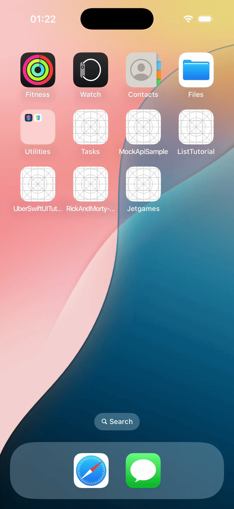
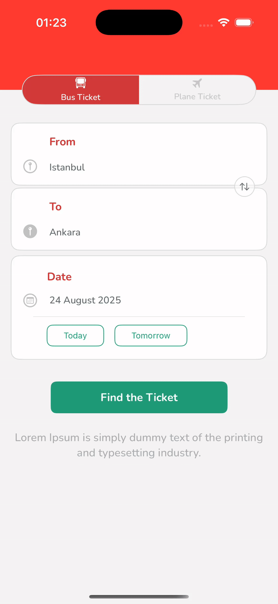
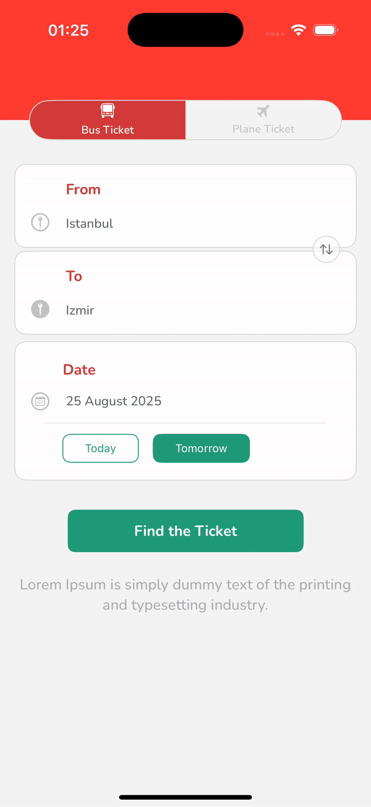
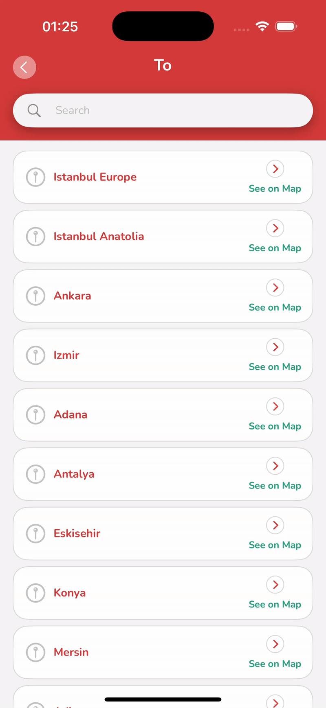

# OBilet iOS Assignment

## Description
OBilet iOS Assignment developed using **SwiftUI**.
This project is the iOS counterpart of the Android version, which you can find [here](https://github.com/berkanturkali/obilet-android-assignment).

## Technologies & Libraries

+ MVVM Architecture
+ SwiftUI for UI
+ Combine for reactive programming
+ Core Data for persistence

## Screens
|                                                       |                                                                                   |                                                                                         |
|:-----------------------------------------------------:|:---------------------------------------------------------------------------------:|:---------------------------------------------------------------------------------------:|
|  |  |  |

|                                                       |                                                                                   |                                                                                         |
|:-----------------------------------------------------:|:---------------------------------------------------------------------------------:|:---------------------------------------------------------------------------------------:|
|  |  |  |

